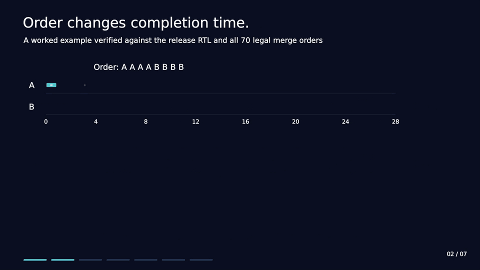

# Lab01 — Out-of-order Instruction Issue Scheduler

OISS finds a legal issue order for eight instructions and the minimum completion
time that order can achieve. The selected design is a purely combinational
circuit using dependency-chain normalization, shared prefix arithmetic and a
bounded-wait threshold dynamic program.

[Watch the architecture film](media/oiss-architecture.mp4) ·
[Read the circuit explanation](docs/ARCHITECTURE.md) ·
[Follow the mathematics](docs/MATHEMATICAL_REDUCTION.md)

## Selected implementations

| Implementation | Cell area (µm²) | Period (ns) | Area × period (µm²·ns) | RTL / timed gate patterns |
|---|---:|---:|---:|---:|
| [Unrolled](rtl/unrolled/OISS.v) | 122,610.902 | 15.6 | 1,912,730.077 | 100,000 / 100,000 |
| [Parameterized](rtl/parameterized/OISS.v) | 126,470.030 | 15.5 | 1,960,285.470 | 100,000 / 100,000 |

The unrolled source has the lower measured area–period product. The parameterized
source expresses much of the same scheduling structure with functions and
generate loops. Both have separately qualified measurements; they differ in
compaction and equal-cost witness selection. Compile one `OISS` implementation
at a time. Their [annotated reading copies](rtl/annotated/README.md) explain the
code without changing executable Verilog.

The [measurement summary](results/README.md) records timing slack, source hashes,
validation scope and result figures. These results establish the best measured
pair presented here, not a proved minimum-area or minimum-delay circuit.

## How it works

1. Decode the eight instructions and their legal opcode latencies.
2. Detect register hazards, identify dependency chains and compact each group.
3. Use a bounded initial-offset search for one chain with independent work,
   or a threshold DP for two chains.
4. Select an attaining order mask and recover the original instruction IDs.

Program completion cycles (`Ex_cycle`) and the physical evaluation period in
nanoseconds are different quantities. The circuit minimizes the former for
each legal input; area times the latter is the physical comparison metric.

| Read next | Contents |
|---|---|
| [Architecture](docs/ARCHITECTURE.md) | Interface, legal inputs, datapath, witness selection and source differences |
| [Mathematical reduction](docs/MATHEMATICAL_REDUCTION.md) | Remove intrinsic work and represent waiting with monotone thresholds |
| [Completion bound](docs/COMPLETION_BOUND.md) | Constructive proof of the tight two-chain bound |
| [Results](results/README.md) | Qualified measurements and comparison figures |

Multiple architectures and implementation choices were evaluated. This collection
presents the selected designs and result figures. For questions about other
approaches, start a [Discussion](https://github.com/IvesLiu1026/NYCU-ICLAB-2026-Fall/discussions) or contact me directly.
