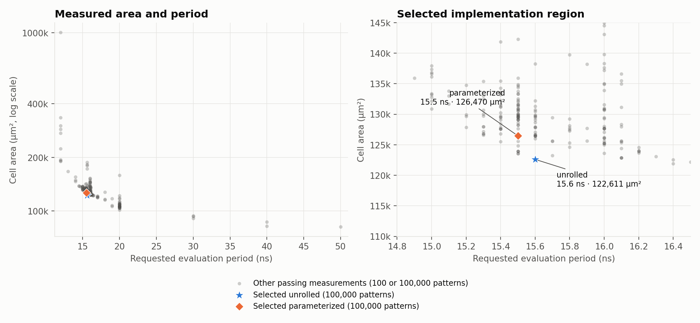
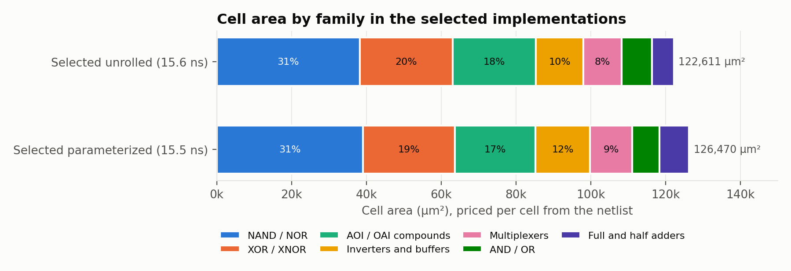
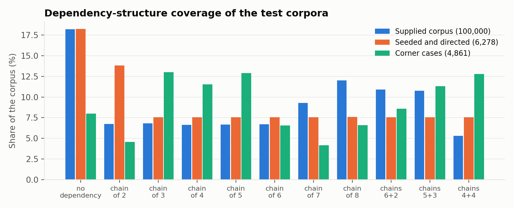

# Measurements and validation

The unrolled implementation has the lower measured area–period product.
The parameterized implementation meets a slightly shorter period with more
cell area. Both implement the same scheduling contract.

## Selected results

| Implementation | Area (µm²) | Period (ns) | Timing slack (ps) | Area × period (µm²·ns) |
|---|---:|---:|---:|---:|
| [Unrolled](../rtl/unrolled/OISS.v) | 122,611 | 15.6 | +1.160 | 1,912,730 |
| [Parameterized](../rtl/parameterized/OISS.v) | 126,470 | 15.5 | +6.074 | 1,960,285 |

Both implementations passed synthesis timing, 100,000 RTL patterns and 100,000
gate-level patterns with SDF timing annotation at their stated periods. Cell area
means synthesized standard-cell area. Timing slack is the remaining timing margin;
both selected operating points are close to their timing constraint.

The unrolled area–period product is 44.9% below a 40 ns reference with an area
of 86,816 µm². That reference passed a smaller 100-pattern RTL and timed gate
screen. This comparison illustrates why minimizing area alone would choose a
different operating point from minimizing area times period.

## Evaluation context

RTL development and initial verification were carried out in my local environment,
with a friend assisting with synthesis and gate-level testing. Synthesis and
timing-annotated gate-level simulation were performed using Synopsys Design Compiler
and VCS with the UMC018 library.

UMC018 is the 180 nm technology. The period is the evaluation-time constraint
for the combinational block; `Ex_cycle` reports the scheduled program's completion
in integer cycles.

## Comparison figures

Gray points show passing measurements from the broader comparison, with either
100-pattern or 100,000-pattern checks. The highlighted implementations have the
100,000-pattern RTL and timed gate coverage stated above. The zoom shows their
tradeoff between cell area and period.

Cell-family areas are summed from the mapped netlists using library cell areas.
The distribution shows which gate families account for the final circuit area.

The coverage figure shows how the validation inputs are distributed across the
supported dependency shapes.

## What validation checks

An independent reference enumerates legal instruction orders and checks three
properties: every instruction appears exactly once, the order respects all
dependencies, and its completion time is optimal. Directed and random legal inputs
also passed functional checks with Verilator and Icarus Verilog.

These checks cover the documented
[input contract](../docs/ARCHITECTURE.md#interface-and-legal-input-contract).
Sampled validation is not an exhaustive correctness proof, and the measured
area–period product is not a proved global physical optimum.

Full-precision measurements, tool versions and source identifiers are available
in the [measurement record](release.json).
