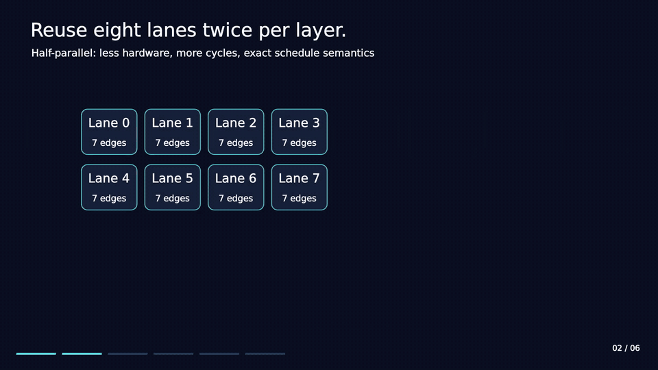

# LDPC architecture film

[Watch the full film](ldpc-architecture.mp4) · [Poster](ldpc-poster.png) ·
[Min-sum example](ldpc-min-sum.gif)

The film is 2 minutes 11 seconds, 1920 × 1080 at 30 fps, with English
on-screen explanations and no audio. Both looping previews are 16 seconds.
It follows the
selected eight-lane decoder through its QC graph, two-half layer schedule,
exact normalized min-sum update, edge-aligned banks, compact rotating records,
and qualified 7.0 ns result. It also shows the approximate comparison rank
and the remaining cost reduction needed to match the reported first place.

The worked check-node example is synthetic and independently checked against
the measured source's arithmetic helpers. Data-motion scenes explain register
roles and fixed permutations; they are conceptual views rather than gate-level
waveforms or a cycle-accurate physical simulation.

See [Architecture](../docs/ARCHITECTURE.md), [Numerical model](../docs/NUMERICAL_MODEL.md)
and [Results](../results/README.md) for the detailed contracts and measurements.

Animation made with [ManimGL](https://github.com/3b1b/manim).
