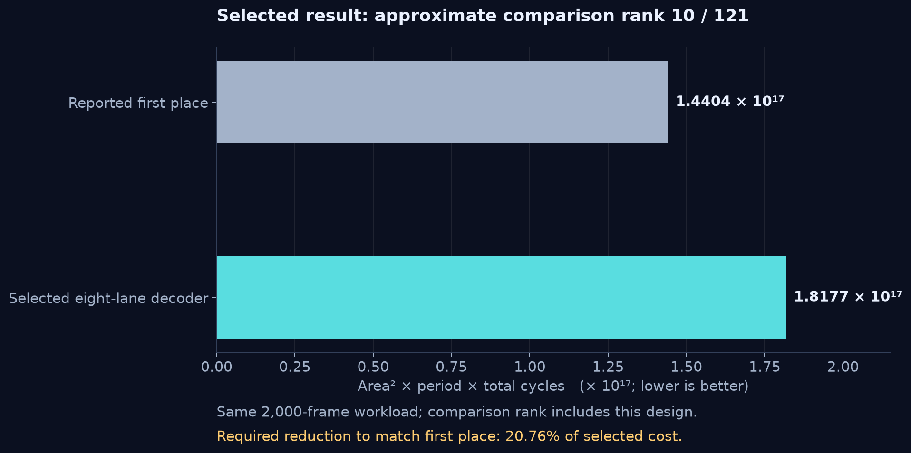
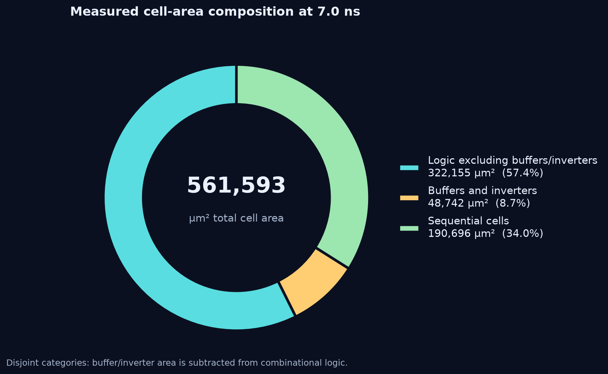
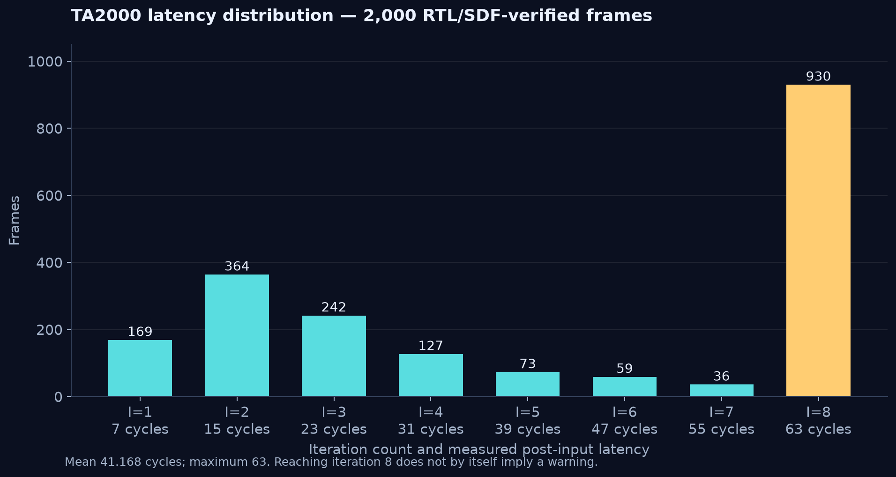

# Selected measurement and comparison rank

The exact selected RTL is qualified at **7.0 ns** with **561,592.795051 µm²**
of cell area. RTL and SDF gate simulation each pass all **2,000** TA2000 frames
at **82,336 total post-input cycles**. Every per-frame latency agrees between
the two simulations.

| Measurement | Value |
| --- | ---: |
| Period | 7.0 ns |
| Cell area | 561,592.795051 µm² |
| Total post-input cycles | 82,336 |
| Mean / minimum / maximum cycles | 41.168 / 7 / 63 |
| Mean decode time | 288.176 ns |
| Sum of decode times | 576,352 ns |
| Area² × period × total cycles | 1.8177362128958355 × 10¹⁷ |
| Setup / hold slack | +0.000152 / +0.275027 ns |
| Inferred latches / constraint violations / gate timing violations | 0 / 0 / 0 |
| Synthesis runtime | 212.84 seconds |

The latency starts after the final input word and ends when output begins.
It excludes mode capture, 128 input cycles, and 128 output cycles. A frame
ending after `I` iterations uses `8I − 1` such cycles. Mean-cycle cost differs
from total-cycle cost by the fixed frame count; compare only matching corpora.

## Approximate rank

This cost inserts at **rank 10 among 121 entries**, comprising 120 valid
results in the comparison snapshot plus this design. The ranking is a
performance comparison, not an official grade or course-assigned rank.
Nine existing reference points have a lower cost, placing the selected design
in the top **8.3%** of this comparison set. The metric is specific to Lab02:
`area² × period × total cycles`; it must not be compared directly with the
Lab01 `CT × Area` ranking.
No participant names, student IDs, accounts or other implementations are
included in this release.

| Reference | Period | Area | Total cycles | Cost |
| --- | ---: | ---: | ---: | ---: |
| Reported first place | 6.8 ns | 726,196 µm² | 40,168 | 1.4404454826 × 10¹⁷ |
| Selected design | 7.0 ns | 561,592.795051 µm² | 82,336 | 1.8177362129 × 10¹⁷ |

The selected cost is about 26.19% above the first-place reference. Equivalently,
it needs a **20.76% reduction from its current cost** to match that reference.
The benchmark's implementation was not inspected or distributed.

## Where the area goes

The area figure separates three disjoint report categories. Buffer/inverter
area is already included in combinational area, so it is subtracted from the
logic category before plotting. These categories describe cell types, not
an inferred functional-module breakdown.

## Iteration stopping and latency

The 2,000-frame histogram comes directly from the complete native checker
output. A total of 930 frames reach iteration eight; this count does not imply
that all of them have a warning, because convergence may occur in that iteration.

## Qualification and reproducibility scope

Synthesis uses Design Compiler T-2022.03 and the UMC 0.18 µm slow standard-cell
corner. Simulation uses VCS T-2022.06 with the mapped netlist and SDF. Actual
RTL, synthesis and gate stages complete successfully; setup, hold and gate
timing checks pass. Eleven `TFIPC` port-connection warnings remain diagnostic;
there are no SDF annotation problems or actual gate timing violations.

[release.json](release.json) pins the RTL, corpus identities, measurements,
latency histogram and comparison scope. Supplied test vectors, licensed
libraries, mapped netlists, tool scripts and raw logs are not distributed.
The release is neither post-layout/power characterization nor proof of a
global optimum or correctness on every hidden input.
