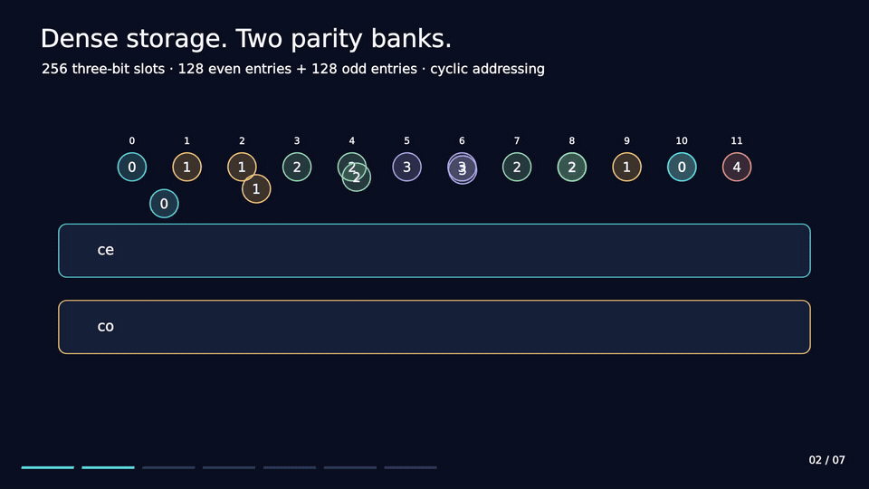
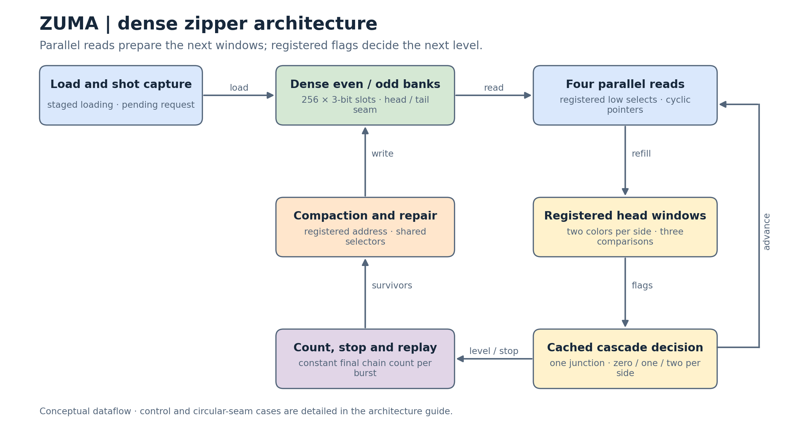

# Lab03 — ZUMA

A sequential circuit for insertion and chain reactions in a circular bead ring.
Dense even/odd storage, small registered head windows and cached comparisons
keep each cascade decision local. Counting the complete chain before replay
allows every output beat to carry the same final chain count.

**Reported performance: 2.8 ns · 157,211 µm² · 5,499 total cycles.**

**Rank 1 / 122 in the snapshot comparison · objective 2.420609 × 10⁹.**

One marble starts a chain reaction. The circuit does the bookkeeping.

[Watch the architecture film](media/zuma-architecture.mp4) ·
[Read the architecture](docs/ARCHITECTURE.md) ·
[Follow a worked cascade](docs/ALGORITHM.md)

## Performance snapshot

| Metric | Reported result |
| --- | ---: |
| Clock period | 2.8 ns |
| Cell area | 157,211 µm² |
| Total latency | 5,499 cycles |
| Period × total cycles | 15,397.2 ns |
| Area × period × total cycles | 2,420,609,209.2 |
| Approximate comparison rank | **Rank 1 / 122** |

The comparison inserts this reported result into the 121 positive results in
the 8 October 2026 snapshot. It is an approximate comparison rank, not an
official course-assigned rank. The [results page](results/README.md) gives the
formula and performance record.

## Architecture walkthrough

1. Load the ring into 256 three-bit slots, split into even and odd banks.
2. Capture a shot and fetch two beads on each side of the insertion boundary.
3. Register the first-level tests and the two head colors on each side.
4. Count later eliminations using cached equality flags while parallel reads
   refill the head windows.
5. Emit the first result with the final chain count, then replay the remaining
   levels in order.
6. Compact the surviving ring, repair the circular seam and accept the next
   legal request.

| Read next | Contents |
| --- | --- |
| [Selected RTL](rtl/ZUMA.v) | Synthesizable Verilog-2005 implementation |
| [Annotated RTL](rtl/annotated/README.md) | Comment-only reading copy and source identity |
| [Architecture](docs/ARCHITECTURE.md) | Banks, read windows, cached frontiers, replay and writes |
| [Cascade algorithm](docs/ALGORITHM.md) | Stable-ring reasoning and a three-level example |
| [Interface and timing](docs/PROTOCOL.md) | Port widths, reset, loading, output and request scheduling |
| [Evaluation](docs/EVALUATION.md) | Source/clock checks and latency accounting |
| [Results](results/README.md) | Reported performance and snapshot comparison |
| [Architecture film](media/README.md) | MP4, looping preview, poster and illustration scope |

[Back to the course index](../README.md)
