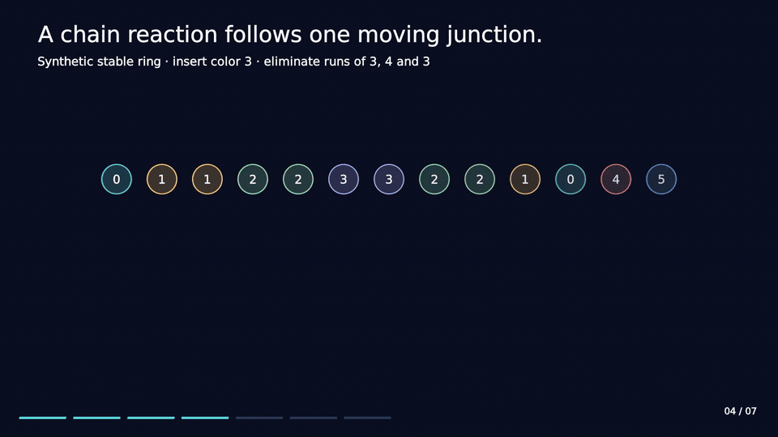

# Why a small zipper can resolve a circular cascade

Treat the ring as an ordered cyclic sequence, with a designated logical zero.
A shot inserts one color after the requested logical position. The empty-ring
case creates the first bead at position zero.

## Only one junction needs attention

A stable ring has no run of three equal colors, including across its seam.
Inserting a bead changes only its two neighboring links. Consequently, any
first elimination must contain the shot. The pre-existing run has length at
most two, so a qualifying first run contains exactly three beads.

After removing that run, only one new link is created: the left survivor joins
the right survivor. All other links are unchanged. At each later level, each
surviving side starts with a run of one or two beads. If the head colors differ,
the cascade stops. If the colors match but neither side extends, the new run
has only two beads and also stops. Otherwise the run contains three or four
beads and is eliminated.

This gives a local decision using two colors per side:

| Head equality | Left extends | Right extends | Result |
| --- | --- | --- | --- |
| false | any | any | Stop |
| true | false | false | Stop: run length two |
| true | true | false | Remove three |
| true | false | true | Remove three |
| true | true | true | Remove four |

The remaining bead count prevents windows from counting the same bead twice
when a very small ring wraps around itself.

## A three-level example

The following example is synthetic; the integers are color IDs. The starting
ring is cyclically stable:

```text
0  1  1  2  2  3  3  2  2  1  0  4  5
               ^ insert color 3 after this bead
```

| Step | Ring after the step | Output record |
| --- | --- | --- |
| Insert | 0 1 1 2 2 3 **3** 3 2 2 1 0 4 5 | — |
| Level 1 | 0 1 1 2 2 2 2 1 0 4 5 | Color 3, count 3 |
| Level 2 | 0 1 1 1 0 4 5 | Color 2, count 4 |
| Level 3 | 0 0 4 5 | Color 1, count 3 |

The final two zeros do not form a run of three, so the cascade stops. All
three output beats carry `chain_num = 3`. The implementation counts the chain
before emitting the first record, then replays the records in order.



## Zero, seam and empty-ring behavior

If an eliminated interval contains logical zero, the first surviving bead
clockwise after that interval becomes the new zero. The implementation caches
whether counting crossed the seam and uses explicit head/tail repair. If no
beads survive, the live count becomes zero. A later shot can refill the empty
ring without a reset.

Correctness depends on this stable-ring invariant and on exact pointer,
remaining-count and replay updates. A visually plausible animation does not
establish the correctness of those updates; see [evaluation](EVALUATION.md).
