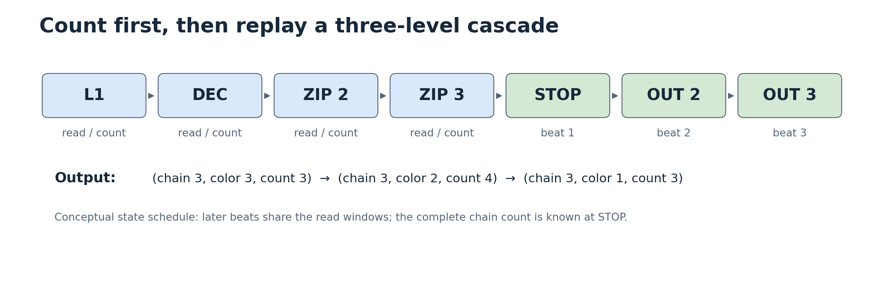

# Dense-ring cascade with cached frontiers

The circuit stores the current logical ring as a dense sequence. Logical
position `2m` is `ce[m]` and position `2m+1` is `co[m]`. Each bank has 128
three-bit entries. A nine-bit `live` count represents every size from zero to
256, including the full ring. A tail mirror and explicit head-slot choices
handle reads across the circular seam.

[Editable diagram](figures/architecture.drawio) ·
[SVG](figures/architecture.svg) · [PDF](figures/architecture.pdf)

## The stable-ring invariant

Before a shot, no cyclic run contains three equal colors. The shot can only
create a run at its insertion boundary. If that run is eliminated, only the
newly joined left and right survivors can start the next elimination. The
circuit therefore follows two outward streams rather than scanning the ring
after every level. See [the algorithm](ALGORITHM.md) for the full argument.

## Four parallel array reads

Each side reads one even-bank entry and one odd-bank entry. Four independent
read results supply a pair behind each registered head window. The low word
selects are eight-bit one-hot registers; the high address chooses one of 16
groups. This factors each 128-entry read into a masked eight-entry reduction
and a high-group selection.

The left fetch pair is `(p, p−1)` and the right pair is `(q, q+1)`. Pointer
parity determines which bank supplies each color. A one-bead advance moves
only the bank word that changes; a two-bead advance moves both. Cached seam
predicates select the exact cyclic restart addresses. The array is not
physically rotated to make a seam read.

## Registered windows and equality flags

Each side holds a six-bit pair of binary colors in `fcL` or `fcR`. Consuming
zero, one or two beads respectively keeps the pair, retains one old bead and
adds a fetched bead, or replaces the complete pair. Alongside the new colors,
the circuit captures three predicates:

| Register | Meaning |
| --- | --- |
| `jq` | Left and right head colors are equal |
| `neqL` | The two left window colors differ |
| `neqR` | The two right window colors differ |

The next level uses these registered predicates. Array selection and color
comparison occur while preparing the next windows, so the following
elimination decision starts from small registered flags.

First-level tests have their own registers. Case A matches the immediate left
and right beads to the shot; case B matches two left beads; case C matches two
right beads. Each includes the required live-size condition. A safe short
path handles no elimination and selected provable single-level results.

## Six frontier-boundary flags

The logical survivor frontiers have cached predicates for left positions
0/1/2 and right positions 0/`live−1`/`live−2`. Normal addresses are recovered
from the existing fetch pointers with fixed offsets. When a consumed pair
crosses the seam, boundary flags choose explicit small or end-of-ring values.
This avoids repeatedly subtracting the live count on common frontier updates.

The predicates also detect whether logical position zero was removed. In
that case, the first clockwise survivor becomes the new logical zero.

## Count, then replay

The bead array stays unchanged during cascade counting. `lvl` records the
number of eliminations and `rem` records the surviving count. The second
level's color/count is saved, and the level-three frontier positions are
captured as replay checkpoints. The stop cycle emits the first result with
the completed chain count. The second result uses the saved record; later
results reuse the windows and read network from the replay checkpoint.

Every output beat carries the same total chain count. Replaying avoids a
large FIFO of all possible color/count records. It costs output-time reads,
which share the counting hardware.

[SVG](figures/count-replay.svg) · [PDF](figures/count-replay.pdf)

## Registered-address compaction

A registered `tp_q` supplies the write address. Shared high/low decoders
produce mutually exclusive hold, insert, shift-up and shift-down selectors
for the 256 slots. Insertion shifts the suffix by one. Compaction moves the
suffix by three positions per step and restores at most two survivors when
the final step would shift too far. Slot-zero repair has explicit priority.
Tiny rings use a direct rebuild from captured survivor colors.

Loading is staged through `iv_q` and `ic_q`. On the first load of each game,
the write terms establish every storage slot; bead storage does not need an
asynchronous reset. Control and observable-output state are reset. New loading
discards the old game. A legal shot arriving during unfinished compaction is
captured once and processed when cleanup reaches its final step.

The [interface guide](PROTOCOL.md) explains the request and output rules.
The [reading copy](../rtl/annotated/ZUMA.v) follows these blocks in source order.
