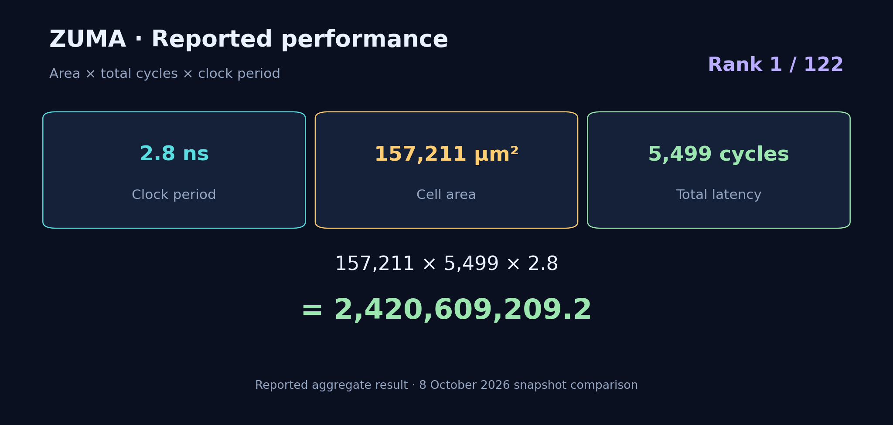

# Reported performance

| Quantity | Reported benchmark |
| --- | ---: |
| Clock period | 2.8 ns |
| Cell area | 157,211 µm² |
| Total latency | 5,499 cycles |
| Total latency × period | 15,397.2 ns |
| Area × total latency × period | **2,420,609,209.2** |
| Approximate snapshot comparison | **Rank 1 / 122** |

```text
157,211 × 5,499 × 2.8 = 2,420,609,209.2
```

The performance point is recorded as a reported aggregate result. The cost is
recomputed directly from its three inputs. Lower cost is better.

## Snapshot rank

The fixed 8 October 2026 snapshot has 121 positive results. Inserting the
reported benchmark produces 122 comparison entries and a first-place position.
This is a comparison rank, not an official assigned course rank.



[SVG](figures/objective.svg) · [PDF](figures/objective.pdf) ·
[Performance data](performance.csv) · [Machine-readable benchmark](benchmark.json)

## Interpretation

Area, cycles and period must be considered together. A lower cycle count can
cost more read/comparison hardware, and a tighter period can change synthesis
mapping. A favorable product describes this benchmark point; it does not
establish a global optimum or predict every possible workload.

The [architecture walkthrough](../docs/ARCHITECTURE.md) explains the selected
dense zipper, and [evaluation](../docs/EVALUATION.md) explains source/clock
qualification and counting rules.
